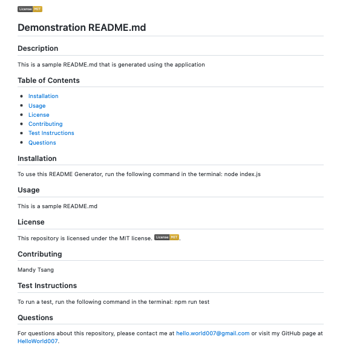

# Professional README Generator

This is a command-line application that dynamically generates a professional README.md file from a user's input. With this, project creators can devote more time on their projects. 

## Getting Started

When the application runs, it presents a series of prompts for the user to fill in. All user's input will be displayed accordingly in the README sections. 

## Built With

* [Javascript](https://developer.mozilla.org/en-US/docs/Web/JavaScript)
* [Node.js](https://nodejs.org/en/)

## Deployed Link

* [Link to walkthrough video](https://youtu.be/Vt4-6wHhNXA)
* [Link to Github](https://github.com/MANDYTSANG007/README-Generator)

## Design Layout

## Authors

* **Mandy Tsang** 

- [Portfolio](https://mandytsang007.github.io/Mandy-Portfolio/)
- [Github](https://github.com/MANDYTSANG007)
- [LinkedIn](https://www.linkedin.com/in/man-tsang-64308b22a/)

## License

This project is licensed under the MIT License 

